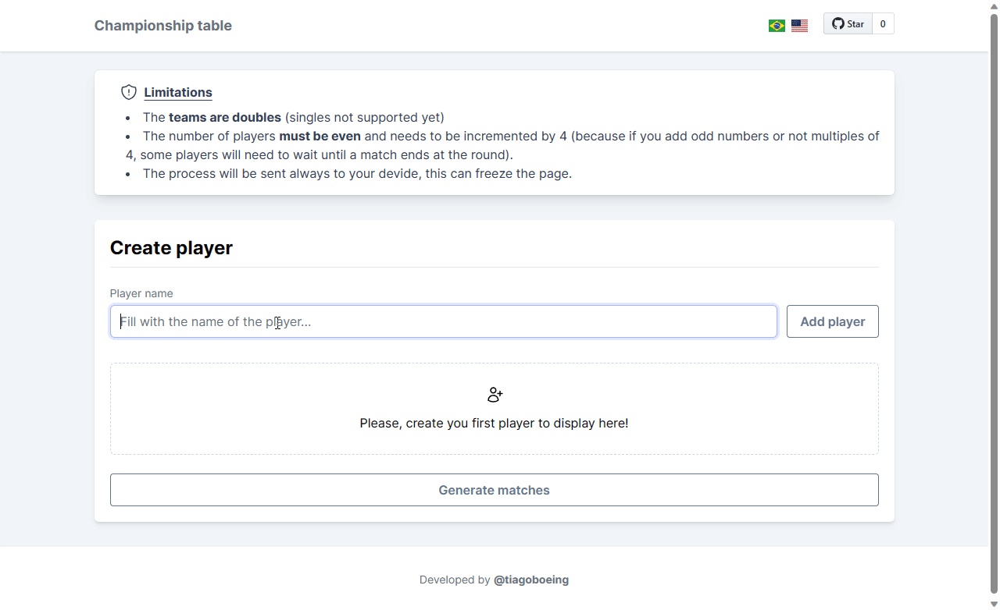

# MatchCraft

Motivated by Beach Tennis games. This project is a web application that generates a table with all combinations of matches with doubles as teams.

## Languages

Available in English and Portuguese.

## How to use

- Add the players incremeting by 4. Click on the button "Add player" to include.
- Click on the button "Generate matches" to generate the table.
- Scroll the page and see the table with all combinations of matches.
- You can print or save the page as PDF, **but print is more recommended**. As an alternative you can use the native browser PDF, just click on print > save as PDF.

## License

This project is licensed under the MIT License - see the [LICENSE](LICENSE) file for details.
